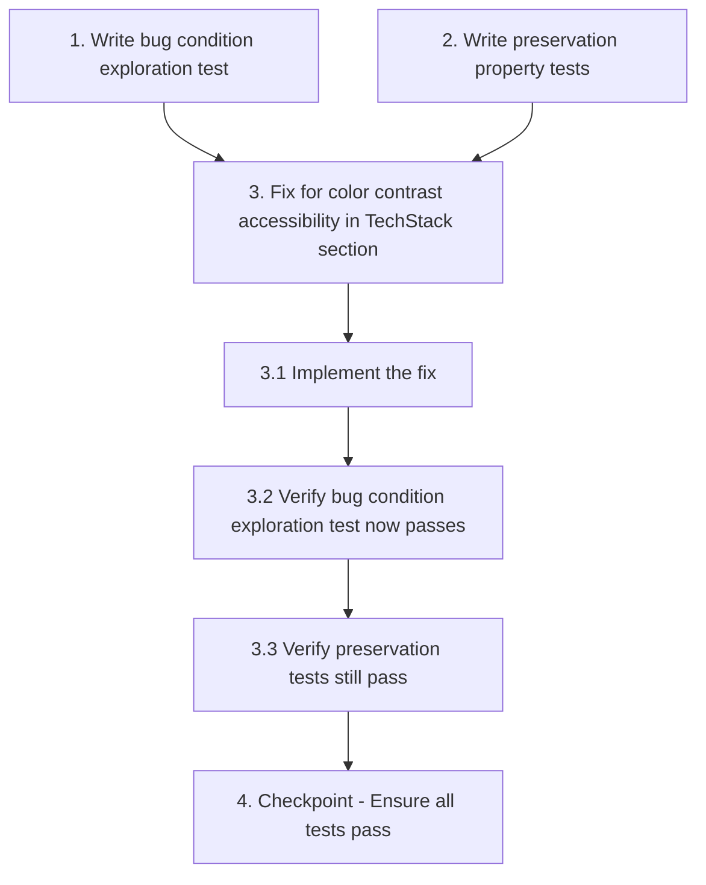

# Implementation Plan

## Overview

This task list implements the fix for color contrast accessibility issues in the TechStack section using the bug condition methodology. The workflow follows: Explore → Preserve → Implement → Validate.

---

## Tasks

- [x] 1. Write bug condition exploration test
  - **Property 1: Bug Condition** - TechStack Links Meet WCAG AA Contrast
  - **CRITICAL**: This test MUST FAIL on unfixed code - failure confirms the bug exists
  - **DO NOT attempt to fix the test or the code when it fails**
  - **NOTE**: This test encodes the expected behavior - it will validate the fix when it passes after implementation
  - **GOAL**: Surface counterexamples that demonstrate the bug exists
  - **Scoped PBT Approach**: For deterministic bugs, scope the property to the concrete failing case(s) to ensure reproducibility
  - Test that TechStack section links using `text-primary-600` on card backgrounds have contrast ratios below 4.5:1
  - Use automated accessibility testing tools (axe-core, Lighthouse, or browser DevTools) to measure contrast ratios
  - Test implementation details from Bug Condition in design: `isBugCondition(element)` where element is a link with `text-primary-600` class within `[data-testid="tech-card"]` and contrast ratio < 4.5:1
  - The test assertions should match the Expected Behavior Properties from design: contrast ratio ≥ 4.5:1
  - Run test on UNFIXED code
  - **EXPECTED OUTCOME**: Test FAILS (this is correct - it proves the bug exists)
  - Document counterexamples found to understand root cause (e.g., "Link to nextjs.org has contrast ratio of 4.2:1, below WCAG AA threshold")
  - Test in both light and dark modes
  - Test all 11 technology links (nextjs.org, typescriptlang.org, tailwindcss.com, jestjs.io, playwright.dev, firebase.google.com, sentry.io, vercel.com, formspree.io, storybook.js.org, sonarqube.org)
  - Mark task complete when test is written, run, and failure is documented
  - _Requirements: 1.1, 1.2, 1.3, 1.4_

- [x] 2. Write preservation property tests (BEFORE implementing fix)
  - **Property 2: Preservation** - Non-TechStack Elements Unchanged
  - **IMPORTANT**: Follow observation-first methodology
  - Observe behavior on UNFIXED code for non-buggy inputs (elements that are NOT TechStack section links)
  - Write property-based tests capturing observed behavior patterns from Preservation Requirements
  - Property-based testing generates many test cases for stronger guarantees
  - Test that links in other sections (Hero, About, Projects, Contact, Footer) continue to use their original colors
  - Test that non-link elements using `text-primary-600` elsewhere remain unchanged
  - Test that card styling (backgrounds, borders, padding, hover effects) remains unchanged
  - Test that non-link text colors (headings, descriptions, labels) in TechStack cards remain unchanged
  - Test that link hover states (underline) continue to work
  - Test that link focus states (focus ring) continue to work
  - Test that ExternalLink icon display remains unchanged
  - Test that grid layout and responsive behavior remain unchanged
  - Run tests on UNFIXED code
  - **EXPECTED OUTCOME**: Tests PASS (this confirms baseline behavior to preserve)
  - Mark task complete when tests are written, run, and passing on unfixed code
  - _Requirements: 3.1, 3.2, 3.3, 3.4, 3.5_

- [x] 3. Fix for color contrast accessibility in TechStack section
  - [x] 3.1 Implement the fix
    - Replace `text-primary-600` with `text-primary-700` for TechStack section links in `components/TechStackSection/index.tsx`
    - Update hover color from `hover:text-primary-700` to `hover:text-primary-800` to maintain visual hierarchy
    - Verify the change is scoped only to TechStack section links (within the component file)
    - Ensure dark mode behavior is correct (Tailwind classes should handle this automatically)
    - Test contrast ratios with browser DevTools or Vercel Debug tool to confirm ≥ 4.5:1
    - Test in both light and dark modes
    - Test across different browsers (Chrome, Firefox, Safari)
    - _Bug_Condition: isBugCondition(element) where element.tagName == 'A' AND element.classList.contains('text-primary-600') AND element.closest('[data-testid="tech-card"]') != null AND contrastRatio(element.color, element.backgroundColor) < 4.5_
    - _Expected_Behavior: For any link element in the TechStack section, the fixed implementation SHALL use a color that provides a minimum contrast ratio of 4.5:1 against the card background (expectedBehavior from design)_
    - _Preservation: Link hover states, focus states, ExternalLink icon, card styling, non-link text colors, layout, and links in other sections must remain unchanged (Preservation Requirements from design)_
    - _Requirements: 1.1, 1.2, 1.3, 1.4, 2.1, 2.2, 2.3, 2.4, 3.1, 3.2, 3.3, 3.4, 3.5_

  - [x] 3.2 Verify bug condition exploration test now passes
    - **Property 1: Expected Behavior** - TechStack Links Meet WCAG AA Contrast
    - **IMPORTANT**: Re-run the SAME test from task 1 - do NOT write a new test
    - The test from task 1 encodes the expected behavior
    - When this test passes, it confirms the expected behavior is satisfied
    - Run bug condition exploration test from step 1
    - **EXPECTED OUTCOME**: Test PASSES (confirms bug is fixed)
    - Verify all 11 technology links now have contrast ratios ≥ 4.5:1
    - Verify in both light and dark modes
    - _Requirements: 2.1, 2.2, 2.3, 2.4_

  - [x] 3.3 Verify preservation tests still pass
    - **Property 2: Preservation** - Non-TechStack Elements Unchanged
    - **IMPORTANT**: Re-run the SAME tests from task 2 - do NOT write new tests
    - Run preservation property tests from step 2
    - **EXPECTED OUTCOME**: Tests PASS (confirms no regressions)
    - Confirm all tests still pass after fix (no regressions)
    - Verify links in other sections remain unchanged
    - Verify card styling remains unchanged
    - Verify non-link text colors remain unchanged
    - Verify hover and focus states remain unchanged
    - _Requirements: 3.1, 3.2, 3.3, 3.4, 3.5_

- [x] 4. Checkpoint - Ensure all tests pass
  - Ensure all tests pass, ask the user if questions arise.
  - Run full test suite to verify no regressions
  - Run Vercel Debug tool or Lighthouse to confirm zero color contrast violations
  - Verify visual appearance in both light and dark modes
  - Verify across different browsers and viewport sizes

---

## Task Dependency Graph



```json
{
  "waves": [
    {
      "name": "Wave 1: Exploration & Preservation Tests",
      "tasks": ["1", "2"],
      "description": "Write bug condition exploration test and preservation tests BEFORE implementing the fix"
    },
    {
      "name": "Wave 2: Implementation",
      "tasks": ["3.1"],
      "description": "Implement the fix for color contrast"
    },
    {
      "name": "Wave 3: Verification",
      "tasks": ["3.2", "3.3"],
      "description": "Verify bug fix and preservation (no regressions)"
    },
    {
      "name": "Wave 4: Checkpoint",
      "tasks": ["4"],
      "description": "Final validation and checkpoint"
    }
  ]
}
```

**Dependency Explanation:**

- **Tasks 1 & 2 → Task 3**: Bug condition exploration test (Task 1) and preservation tests (Task 2) must be written BEFORE implementing the fix (Task 3). This follows the bugfix methodology: understand the bug first, then fix it.
- **Task 3 → Subtask 3.1**: The parent task must be started before the implementation subtask.
- **Subtask 3.1 → Subtask 3.2**: Implementation must be complete before verifying the bug condition test passes.
- **Subtask 3.2 → Subtask 3.3**: Bug fix verification must pass before checking preservation (no regressions).
- **Subtask 3.3 → Task 4**: All verification must be complete before final checkpoint.

---

## Notes

- This workflow uses the bug condition methodology: C(X) identifies buggy inputs, P(result) defines expected behavior, ¬C(X) identifies behavior to preserve
- Exploration test (task 1) should FAIL on unfixed code - this confirms the bug exists
- Preservation tests (task 2) should PASS on unfixed code - this confirms baseline behavior
- After implementation, exploration test should PASS and preservation tests should still PASS
- The fix is scoped to TechStack section links only to minimize risk of regressions
