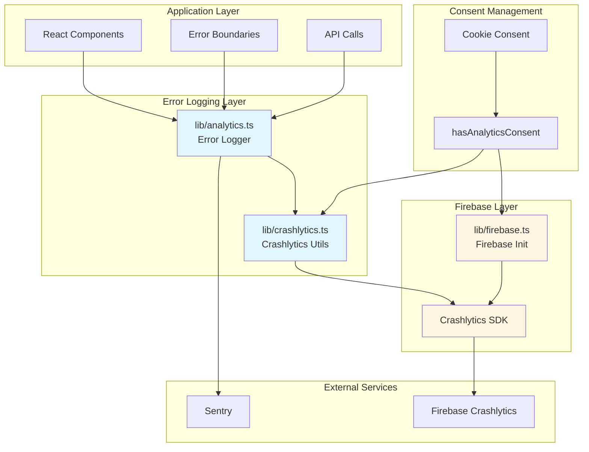
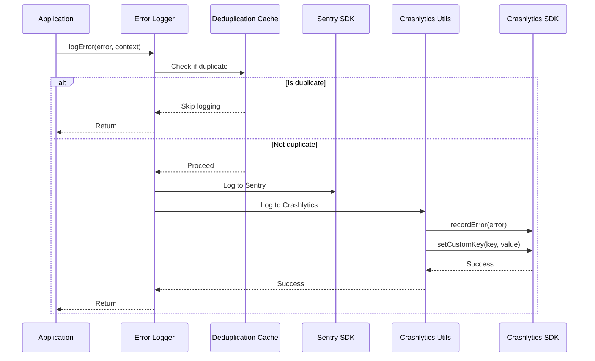
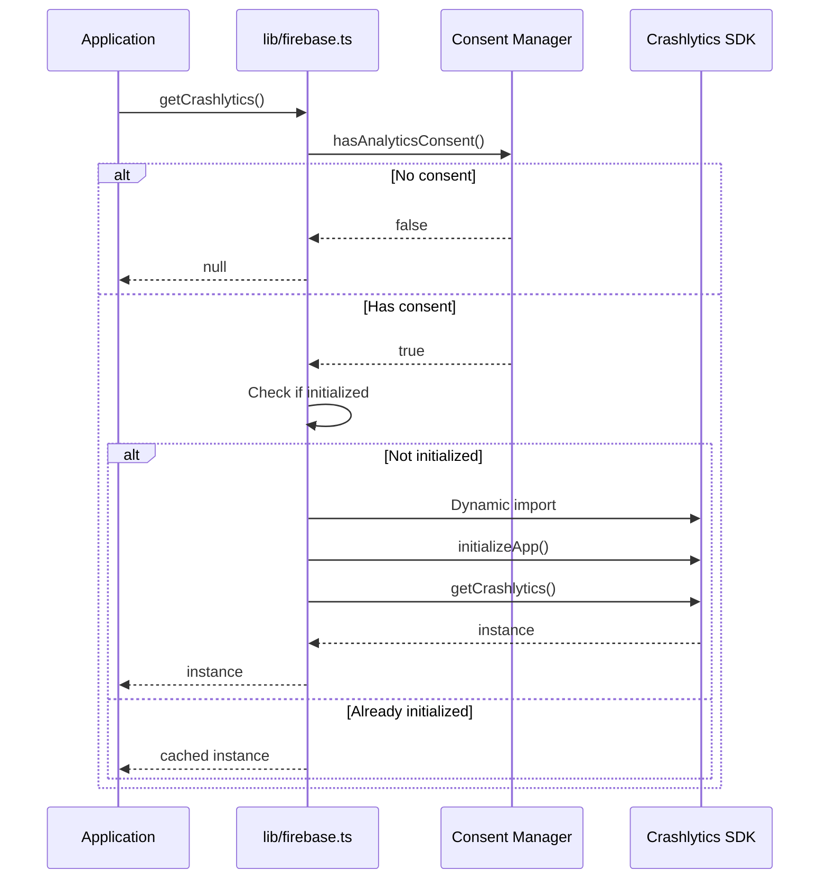

# Technical Design Document: Firebase Crashlytics Integration

## Overview

### Purpose

This design document specifies the technical implementation for integrating Firebase Crashlytics into the personal resume website. Crashlytics will provide comprehensive crash reporting and monitoring capabilities alongside the existing Sentry integration, enabling better visibility into production errors and application stability.

### Scope

The integration encompasses:

- **Crashlytics SDK initialization** with consent-aware lazy loading
- **Dual error logging** to both Sentry and Crashlytics
- **Custom logging infrastructure** for breadcrumbs and debugging context
- **Source map configuration** for readable production stack traces
- **CI/CD pipeline integration** for automated testing and validation
- **Comprehensive testing strategy** including unit, integration, and property-based tests

### Goals

1. **Seamless Integration**: Add Crashlytics without disrupting existing Sentry error logging
2. **Privacy Compliance**: Respect user consent preferences for analytics and crash reporting
3. **Developer Experience**: Provide clear APIs for error logging with rich context
4. **Production Readiness**: Ensure crash reports include source maps and debugging metadata
5. **Performance**: Minimize bundle size impact through code splitting and lazy loading

### Non-Goals

- Replacing Sentry (both systems will coexist)
- Real-time crash alerting (handled by Firebase console configuration)
- Custom crash report UI (using Firebase console)
- Automatic crash recovery mechanisms

## Architecture

### High-Level Architecture



### Component Responsibilities

#### lib/firebase.ts (Extended)

- Initialize Crashlytics SDK using singleton pattern
- Check user consent before initialization
- Provide `getCrashlytics()` function returning Crashlytics instance or null
- Handle initialization failures gracefully

#### lib/crashlytics.ts (New)

- Provide utility functions for Crashlytics operations
- Implement breadcrumb logging
- Implement custom key/value attachment
- Implement user identifier management
- Handle Crashlytics unavailability gracefully

#### lib/analytics.ts (Extended)

- Extend existing error logging to include Crashlytics
- Implement error deduplication logic
- Provide unified API for logging errors with context
- Coordinate between Sentry and Crashlytics

#### Error Boundaries

- Catch React component errors
- Log to both Sentry and Crashlytics
- Provide fallback UI
- Include component stack traces

### Data Flow

#### Error Logging Flow



#### Initialization Flow



## Components and Interfaces

### lib/firebase.ts Extensions

#### getCrashlytics Function

```typescript
/**
 * Returns the Firebase Crashlytics instance.
 * Only available in browser environments with user consent.
 * Returns null in SSR/Node.js environments, when config is missing, or when user hasn't consented.
 * Dynamically imports Firebase Crashlytics to reduce initial bundle size.
 *
 * @returns Promise<Crashlytics | null> - Crashlytics instance or null
 */
export async function getCrashlytics(): Promise<Crashlytics | null>;
```

**Implementation Details:**

- Check `typeof window === "undefined"` for SSR detection
- Call `hasAnalyticsConsent()` to verify user consent
- Use singleton pattern with module-level `crashlytics` variable
- Dynamic import: `await import("firebase/crashlytics")`
- Call `getCrashlytics(firebaseApp)` from SDK
- Catch and log initialization errors without throwing
- Return `null` on any failure

**Requirements Addressed:** 1.2, 1.3, 1.4, 1.5, 2.1, 2.2, 2.4, 8.4

### lib/crashlytics.ts (New Module)

#### Module Structure

```typescript
/**
 * Firebase Crashlytics utility functions.
 * Provides typed wrappers for Crashlytics operations with graceful fallbacks.
 */

import { getCrashlytics } from "./firebase";
import type { Crashlytics } from "firebase/crashlytics";

// ─── Breadcrumb Logging ───────────────────────────────────────────────────────

/**
 * Logs a breadcrumb to Crashlytics for debugging context.
 * Breadcrumbs help understand the sequence of events leading to a crash.
 *
 * @param message - The breadcrumb message
 * @returns Promise<void>
 */
export async function logBreadcrumb(message: string): Promise<void>;

// ─── Custom Keys ──────────────────────────────────────────────────────────────

/**
 * Sets a custom key-value pair for crash reports.
 * Custom keys provide additional context for debugging.
 *
 * @param key - The custom key name
 * @param value - The custom key value (string, number, or boolean)
 * @returns Promise<void>
 */
export async function setCustomKey(key: string, value: string | number | boolean): Promise<void>;

// ─── User Identification ──────────────────────────────────────────────────────

/**
 * Sets a user identifier for crash reports.
 * Use non-PII identifiers (e.g., hashed user ID, session ID).
 *
 * @param userId - Non-PII user identifier
 * @returns Promise<void>
 */
export async function setUserId(userId: string): Promise<void>;

// ─── Error Recording ──────────────────────────────────────────────────────────

/**
 * Records a non-fatal error to Crashlytics.
 *
 * @param error - The error to record
 * @param context - Optional context object with custom keys
 * @returns Promise<void>
 */
export async function recordError(
  error: Error,
  context?: Record<string, string | number | boolean>
): Promise<void>;
```

**Implementation Pattern:**
Each function follows this pattern:

1. Get Crashlytics instance via `getCrashlytics()`
2. If null, return early (no-op)
3. Dynamic import of required Crashlytics function
4. Execute operation
5. Catch and log errors without throwing

**Requirements Addressed:** 5.1, 5.2, 5.3, 5.4, 5.5

### lib/analytics.ts Extensions

#### Error Logging Functions

```typescript
// ─── Error Deduplication ──────────────────────────────────────────────────────

interface ErrorCacheEntry {
  message: string;
  stack: string;
  timestamp: number;
}

const errorCache = new Map<string, ErrorCacheEntry>();
const DEDUP_WINDOW_MS = 5000; // 5 seconds

/**
 * Generates a cache key for error deduplication.
 */
function getErrorCacheKey(error: Error): string {
  return `${error.message}:${error.stack?.substring(0, 100)}`;
}

/**
 * Checks if an error was recently logged.
 */
function isDuplicateError(error: Error): boolean {
  const key = getErrorCacheKey(error);
  const cached = errorCache.get(key);

  if (!cached) return false;

  const now = Date.now();
  if (now - cached.timestamp > DEDUP_WINDOW_MS) {
    errorCache.delete(key);
    return false;
  }

  return true;
}

/**
 * Marks an error as logged in the deduplication cache.
 */
function cacheError(error: Error): void {
  const key = getErrorCacheKey(error);
  errorCache.set(key, {
    message: error.message,
    stack: error.stack || "",
    timestamp: Date.now(),
  });

  // Clean up old entries
  setTimeout(() => errorCache.delete(key), DEDUP_WINDOW_MS);
}

// ─── Error Logging ────────────────────────────────────────────────────────────

export interface ErrorContext {
  /** Error severity level */
  severity?: "fatal" | "error" | "warning" | "info";
  /** Custom metadata key-value pairs */
  metadata?: Record<string, string | number | boolean>;
  /** Force logging even if duplicate */
  force?: boolean;
  /** Component name where error occurred */
  component?: string;
  /** User action that triggered the error */
  action?: string;
}

/**
 * Logs an error to both Sentry and Crashlytics.
 * Includes automatic context capture (URL, locale, theme).
 * Implements deduplication to prevent spam.
 *
 * @param error - The error to log
 * @param context - Optional error context
 * @returns Promise<void>
 */
export async function logError(error: Error, context?: ErrorContext): Promise<void>;
```

**Implementation Details:**

1. **Deduplication Check:**
   - Skip if duplicate and not forced
   - Use error message + stack trace for matching

2. **Context Enrichment:**
   - Capture current URL: `window.location.href`
   - Capture locale: from URL or localStorage
   - Capture theme: from localStorage or data attribute
   - Merge with provided metadata

3. **Sentry Logging:**
   - Use existing Sentry integration
   - Pass severity and context
   - Include component stack if available

4. **Crashlytics Logging:**
   - Import `recordError` from lib/crashlytics.ts
   - Set custom keys for all context metadata
   - Log breadcrumb with error message
   - Record error with `recordError()`

5. **Cache Update:**
   - Mark error as logged in deduplication cache

**Requirements Addressed:** 3.1, 3.2, 3.3, 3.4, 3.5, 11.1, 11.2, 11.3, 11.4, 11.5, 13.1, 13.2, 13.3, 13.4, 13.5

### Error Boundary Component

#### ErrorBoundary.tsx

```typescript
/**
 * React Error Boundary for catching and logging component errors.
 * Logs errors to both Sentry and Crashlytics.
 */

import React, { Component, ErrorInfo, ReactNode } from "react";
import { logError } from "@/lib/analytics";

interface Props {
  children: ReactNode;
  fallback?: ReactNode;
}

interface State {
  hasError: boolean;
  error: Error | null;
}

export class ErrorBoundary extends Component<Props, State> {
  constructor(props: Props) {
    super(props);
    this.state = { hasError: false, error: null };
  }

  static getDerivedStateFromError(error: Error): State {
    return { hasError: true, error };
  }

  componentDidCatch(error: Error, errorInfo: ErrorInfo): void {
    // Log to both Sentry and Crashlytics
    logError(error, {
      severity: "error",
      metadata: {
        component_stack: errorInfo.componentStack || "",
        error_boundary: "ErrorBoundary",
      },
      component: "ErrorBoundary",
    });
  }

  render(): ReactNode {
    if (this.state.hasError) {
      return this.props.fallback || (
        <div role="alert">
          <h2>Something went wrong</h2>
          <p>We've been notified and are working on a fix.</p>
        </div>
      );
    }

    return this.props.children;
  }
}
```

**Requirements Addressed:** 4.1, 4.2, 4.3, 4.4

### Global Error Handlers

#### app/layout.tsx Extensions

```typescript
"use client";

import { useEffect } from "react";
import { logError } from "@/lib/analytics";

export function GlobalErrorHandlers() {
  useEffect(() => {
    // Handle uncaught errors
    const handleError = (event: ErrorEvent) => {
      event.preventDefault();
      logError(event.error, {
        severity: "fatal",
        metadata: {
          filename: event.filename,
          lineno: event.lineno,
          colno: event.colno,
        },
        action: "uncaught_error",
      });
    };

    // Handle unhandled promise rejections
    const handleRejection = (event: PromiseRejectionEvent) => {
      event.preventDefault();
      const error = event.reason instanceof Error ? event.reason : new Error(String(event.reason));

      logError(error, {
        severity: "error",
        metadata: {
          promise_rejection: true,
        },
        action: "unhandled_rejection",
      });
    };

    window.addEventListener("error", handleError);
    window.addEventListener("unhandledrejection", handleRejection);

    return () => {
      window.removeEventListener("error", handleError);
      window.removeEventListener("unhandledrejection", handleRejection);
    };
  }, []);

  return null;
}
```

**Requirements Addressed:** 4.1, 4.2, 4.3, 4.5

## Data Models

### Error Context Model

```typescript
interface ErrorContext {
  /** Error severity level */
  severity?: "fatal" | "error" | "warning" | "info";

  /** Custom metadata key-value pairs */
  metadata?: Record<string, string | number | boolean>;

  /** Force logging even if duplicate */
  force?: boolean;

  /** Component name where error occurred */
  component?: string;

  /** User action that triggered the error */
  action?: string;
}
```

### Error Cache Entry Model

```typescript
interface ErrorCacheEntry {
  /** Error message */
  message: string;

  /** Error stack trace (first 100 chars) */
  stack: string;

  /** Timestamp when error was logged */
  timestamp: number;
}
```

### Crashlytics Configuration Model

```typescript
interface CrashlyticsConfig {
  /** Enable debug logging in development */
  debug: boolean;

  /** Deduplication window in milliseconds */
  dedupWindowMs: number;

  /** Maximum breadcrumb count */
  maxBreadcrumbs: number;

  /** Sanitize sensitive data */
  sanitizeData: boolean;
}
```

### Automatic Context Capture

The error logging system automatically captures the following context:

```typescript
interface AutoCapturedContext {
  /** Current page URL */
  page_url: string;

  /** User's locale (e.g., "en", "pt") */
  locale: string;

  /** User's theme preference ("light" | "dark") */
  theme: string;

  /** User agent string */
  user_agent: string;

  /** Viewport dimensions */
  viewport_width: number;
  viewport_height: number;

  /** Timestamp (ISO 8601) */
  timestamp: string;
}
```

## Correctness Properties

_A property is a characteristic or behavior that should hold true across all valid executions of a system—essentially, a formal statement about what the system should do. Properties serve as the bridge between human-readable specifications and machine-verifiable correctness guarantees._

**Note on Property-Based Testing Applicability:**

This feature is primarily about integration with external services (Firebase Crashlytics, Sentry), configuration, and side-effect operations. Most requirements are best tested with example-based unit tests and integration tests with mocks. However, a few core algorithms benefit from property-based testing:

### Property 1: Error Deduplication Timing Window

_For any_ sequence of identical errors logged within a 5-second window, only the first error SHALL be reported to Crashlytics and Sentry, while subsequent duplicates SHALL be suppressed until the window expires.

**Validates: Requirements 4.5, 13.2**

### Property 2: Error Deduplication Matching

_For any_ two errors with the same message and stack trace (first 100 characters), the deduplication system SHALL identify them as duplicates, while errors with different messages or stack traces SHALL be treated as distinct errors.

**Validates: Requirements 13.3**

### Property 3: Metadata Sanitization

_For any_ metadata object containing sensitive patterns (e.g., "password", "token", "secret", "apiKey", "creditCard"), the sanitization function SHALL remove or redact those fields before attaching them to crash reports.

**Validates: Requirements 11.5**

### Property 4: Deduplication Cache Expiration

_For any_ error logged to the deduplication cache, after 5 seconds have elapsed, the same error SHALL be treated as a new error and reported again if it occurs.

**Validates: Requirements 13.4**

## Error Handling

### Initialization Failures

**Scenario:** Crashlytics SDK fails to initialize

**Handling:**

1. Log warning to console with error details
2. Return `null` from `getCrashlytics()`
3. All Crashlytics utility functions become no-ops
4. Application continues normally
5. Sentry logging remains functional

**Example:**

```typescript
try {
  const { getCrashlytics } = await import("firebase/crashlytics");
  crashlytics = getCrashlytics(firebaseApp);
} catch (error) {
  console.warn("[Firebase] Crashlytics initialization failed:", error);
  return null;
}
```

### Missing Configuration

**Scenario:** Firebase environment variables are not set

**Handling:**

1. `isFirebaseConfigured()` returns `false`
2. `getCrashlytics()` returns `null` early
3. Log warning in development mode only
4. Application continues normally

**Example:**

```typescript
if (!isFirebaseConfigured()) {
  if (process.env.NODE_ENV === "development") {
    console.warn("[Firebase] Crashlytics not configured");
  }
  return null;
}
```

### No User Consent

**Scenario:** User has not granted analytics consent

**Handling:**

1. `hasAnalyticsConsent()` returns `false`
2. `getCrashlytics()` returns `null` early
3. No warning logged (expected behavior)
4. No crash data collected

**Example:**

```typescript
if (!hasAnalyticsConsent()) {
  return null;
}
```

### Network Failures

**Scenario:** Crashlytics cannot send crash reports due to network issues

**Handling:**

1. Firebase SDK handles retry logic automatically
2. Reports are queued locally
3. Sent when network is restored
4. No application-level handling needed

### Sentry Integration Failures

**Scenario:** Sentry logging fails but Crashlytics is available

**Handling:**

1. Catch Sentry errors in `logError()`
2. Log warning to console
3. Continue with Crashlytics logging
4. Don't throw error to caller

**Example:**

```typescript
try {
  // Log to Sentry
  Sentry.captureException(error, { ...context });
} catch (sentryError) {
  console.warn("[Analytics] Sentry logging failed:", sentryError);
}

// Continue with Crashlytics
await recordError(error, context.metadata);
```

### Crashlytics Logging Failures

**Scenario:** Crashlytics logging fails but Sentry is available

**Handling:**

1. Catch Crashlytics errors in utility functions
2. Log warning to console
3. Don't throw error to caller
4. Sentry logging already completed

**Example:**

```typescript
export async function recordError(error: Error): Promise<void> {
  try {
    const crashlytics = await getCrashlytics();
    if (!crashlytics) return;

    const { recordError: sdkRecordError } = await import("firebase/crashlytics");
    sdkRecordError(crashlytics, error);
  } catch (err) {
    console.warn("[Crashlytics] Failed to record error:", err);
  }
}
```

### Deduplication Edge Cases

**Scenario:** Error cache grows too large

**Handling:**

1. Automatic cleanup after 5-second window
2. Use `setTimeout` to delete entries
3. No manual cache size management needed
4. Memory usage bounded by error frequency

**Scenario:** Errors with identical messages but different stack traces

**Handling:**

1. Use first 100 characters of stack trace in cache key
2. Treat as different errors
3. Both are logged

**Scenario:** Force flag bypasses deduplication

**Handling:**

1. Check `context.force` flag before deduplication
2. Skip cache check if `force === true`
3. Always log error
4. Still add to cache for future deduplication

## Testing Strategy

### Overview

The testing strategy combines multiple approaches to ensure comprehensive coverage:

1. **Unit Tests**: Test individual functions and modules in isolation
2. **Integration Tests**: Test interaction between components and external services
3. **Property-Based Tests**: Test universal properties of core algorithms (deduplication, sanitization)
4. **End-to-End Tests**: Test complete error logging flow in browser environment
5. **Manual Tests**: Verify Firebase console configuration and source maps

### Unit Tests

#### lib/firebase.ts Tests

**Test Suite: getCrashlytics()**

```typescript
describe("getCrashlytics", () => {
  it("returns null in SSR environment", async () => {
    // Mock window as undefined
    const result = await getCrashlytics();
    expect(result).toBeNull();
  });

  it("returns null when consent not granted", async () => {
    mockLocalStorage({ "cookie-consent": "rejected" });
    const result = await getCrashlytics();
    expect(result).toBeNull();
  });

  it("initializes Crashlytics when consent granted", async () => {
    mockLocalStorage({ "cookie-consent": "accepted" });
    const result = await getCrashlytics();
    expect(result).not.toBeNull();
  });

  it("returns same instance on multiple calls (singleton)", async () => {
    mockLocalStorage({ "cookie-consent": "accepted" });
    const first = await getCrashlytics();
    const second = await getCrashlytics();
    expect(first).toBe(second);
  });

  it("handles initialization errors gracefully", async () => {
    mockCrashlyticsInitError();
    const result = await getCrashlytics();
    expect(result).toBeNull();
    expect(console.warn).toHaveBeenCalled();
  });
});
```

**Requirements Validated:** 1.2, 1.4, 1.5, 2.1, 2.2, 2.4, 8.4, 8.5

#### lib/crashlytics.ts Tests

**Test Suite: Crashlytics Utilities**

```typescript
describe("Crashlytics Utilities", () => {
  describe("logBreadcrumb", () => {
    it("calls Crashlytics log() with message", async () => {
      const mockLog = jest.fn();
      mockCrashlytics({ log: mockLog });

      await logBreadcrumb("User clicked button");

      expect(mockLog).toHaveBeenCalledWith("User clicked button");
    });

    it("handles Crashlytics unavailable gracefully", async () => {
      mockCrashlytics(null);
      await expect(logBreadcrumb("test")).resolves.not.toThrow();
    });
  });

  describe("setCustomKey", () => {
    it("calls Crashlytics setCustomKey() with key and value", async () => {
      const mockSetCustomKey = jest.fn();
      mockCrashlytics({ setCustomKey: mockSetCustomKey });

      await setCustomKey("user_locale", "en");

      expect(mockSetCustomKey).toHaveBeenCalledWith("user_locale", "en");
    });

    it("supports string, number, and boolean values", async () => {
      const mockSetCustomKey = jest.fn();
      mockCrashlytics({ setCustomKey: mockSetCustomKey });

      await setCustomKey("string_key", "value");
      await setCustomKey("number_key", 42);
      await setCustomKey("boolean_key", true);

      expect(mockSetCustomKey).toHaveBeenCalledTimes(3);
    });
  });

  describe("setUserId", () => {
    it("calls Crashlytics setUserId() with identifier", async () => {
      const mockSetUserId = jest.fn();
      mockCrashlytics({ setUserId: mockSetUserId });

      await setUserId("user_123");

      expect(mockSetUserId).toHaveBeenCalledWith("user_123");
    });
  });

  describe("recordError", () => {
    it("calls Crashlytics recordError() with error", async () => {
      const mockRecordError = jest.fn();
      mockCrashlytics({ recordError: mockRecordError });

      const error = new Error("Test error");
      await recordError(error);

      expect(mockRecordError).toHaveBeenCalledWith(error);
    });

    it("sets custom keys from context", async () => {
      const mockSetCustomKey = jest.fn();
      const mockRecordError = jest.fn();
      mockCrashlytics({ setCustomKey: mockSetCustomKey, recordError: mockRecordError });

      const error = new Error("Test error");
      await recordError(error, { page: "home", user_id: "123" });

      expect(mockSetCustomKey).toHaveBeenCalledWith("page", "home");
      expect(mockSetCustomKey).toHaveBeenCalledWith("user_id", "123");
      expect(mockRecordError).toHaveBeenCalledWith(error);
    });
  });
});
```

**Requirements Validated:** 5.1, 5.2, 5.3, 5.4, 5.5

#### lib/analytics.ts Tests

**Test Suite: Error Logging**

```typescript
describe("logError", () => {
  beforeEach(() => {
    jest.clearAllMocks();
    errorCache.clear();
  });

  it("logs error to both Sentry and Crashlytics", async () => {
    const mockSentry = jest.spyOn(Sentry, "captureException");
    const mockCrashlytics = jest.fn();
    mockRecordError(mockCrashlytics);

    const error = new Error("Test error");
    await logError(error);

    expect(mockSentry).toHaveBeenCalledWith(error, expect.any(Object));
    expect(mockCrashlytics).toHaveBeenCalledWith(error, expect.any(Object));
  });

  it("captures automatic context (URL, locale, theme)", async () => {
    mockWindow({ location: { href: "https://example.com/page" } });
    mockLocalStorage({ locale: "en", theme: "dark" });

    const mockSentry = jest.spyOn(Sentry, "captureException");
    const error = new Error("Test error");
    await logError(error);

    expect(mockSentry).toHaveBeenCalledWith(error, {
      contexts: expect.objectContaining({
        page_url: "https://example.com/page",
        locale: "en",
        theme: "dark",
      }),
    });
  });

  it("handles Sentry failure gracefully", async () => {
    jest.spyOn(Sentry, "captureException").mockImplementation(() => {
      throw new Error("Sentry error");
    });
    const mockCrashlytics = jest.fn();
    mockRecordError(mockCrashlytics);

    const error = new Error("Test error");
    await expect(logError(error)).resolves.not.toThrow();
    expect(mockCrashlytics).toHaveBeenCalled();
  });

  it("handles Crashlytics failure gracefully", async () => {
    const mockSentry = jest.spyOn(Sentry, "captureException");
    mockRecordError(() => {
      throw new Error("Crashlytics error");
    });

    const error = new Error("Test error");
    await expect(logError(error)).resolves.not.toThrow();
    expect(mockSentry).toHaveBeenCalled();
  });

  it("includes stack trace in reports", async () => {
    const mockSentry = jest.spyOn(Sentry, "captureException");
    const error = new Error("Test error");
    error.stack = "Error: Test error\n  at test.ts:10:5";

    await logError(error);

    expect(mockSentry).toHaveBeenCalledWith(
      expect.objectContaining({ stack: expect.stringContaining("test.ts:10:5") }),
      expect.any(Object)
    );
  });
});
```

**Requirements Validated:** 3.1, 3.2, 3.3, 3.4, 4.4, 11.1, 11.2, 11.3, 11.4

### Property-Based Tests

Property-based tests use the `fast-check` library to generate random inputs and verify universal properties. Each test runs a minimum of 100 iterations.

#### Error Deduplication Properties

```typescript
import fc from "fast-check";

describe("Error Deduplication Properties", () => {
  /**
   * Feature: firebase-crashlytics-integration, Property 1: Error Deduplication Timing Window
   * For any sequence of identical errors logged within a 5-second window,
   * only the first error SHALL be reported.
   */
  it("deduplicates identical errors within 5-second window", async () => {
    await fc.assert(
      fc.asyncProperty(
        fc.array(fc.integer({ min: 0, max: 4999 }), { minLength: 2, maxLength: 10 }),
        async (timings) => {
          const mockSentry = jest.fn();
          const mockCrashlytics = jest.fn();
          jest.spyOn(Sentry, "captureException").mockImplementation(mockSentry);
          mockRecordError(mockCrashlytics);

          const error = new Error("Duplicate error");
          let currentTime = 0;

          for (const delay of timings) {
            currentTime += delay;
            jest.advanceTimersByTime(delay);
            await logError(error);
          }

          // Only first error should be logged
          expect(mockSentry).toHaveBeenCalledTimes(1);
          expect(mockCrashlytics).toHaveBeenCalledTimes(1);
        }
      ),
      { numRuns: 100 }
    );
  });

  /**
   * Feature: firebase-crashlytics-integration, Property 2: Error Deduplication Matching
   * For any two errors with the same message and stack trace,
   * the deduplication system SHALL identify them as duplicates.
   */
  it("matches errors by message and stack trace", async () => {
    await fc.assert(
      fc.asyncProperty(
        fc.string({ minLength: 1, maxLength: 100 }),
        fc.string({ minLength: 10, maxLength: 200 }),
        async (message, stack) => {
          const mockSentry = jest.fn();
          jest.spyOn(Sentry, "captureException").mockImplementation(mockSentry);

          const error1 = new Error(message);
          error1.stack = stack;
          const error2 = new Error(message);
          error2.stack = stack;

          await logError(error1);
          await logError(error2);

          // Second error should be deduplicated
          expect(mockSentry).toHaveBeenCalledTimes(1);
        }
      ),
      { numRuns: 100 }
    );
  });

  /**
   * Feature: firebase-crashlytics-integration, Property 4: Deduplication Cache Expiration
   * For any error logged to the deduplication cache,
   * after 5 seconds have elapsed, the same error SHALL be treated as new.
   */
  it("expires cache entries after 5 seconds", async () => {
    await fc.assert(
      fc.asyncProperty(fc.integer({ min: 5000, max: 10000 }), async (delay) => {
        const mockSentry = jest.fn();
        jest.spyOn(Sentry, "captureException").mockImplementation(mockSentry);

        const error = new Error("Test error");

        await logError(error);
        jest.advanceTimersByTime(delay);
        await logError(error);

        // Both errors should be logged (cache expired)
        expect(mockSentry).toHaveBeenCalledTimes(2);
      }),
      { numRuns: 100 }
    );
  });
});
```

**Requirements Validated:** 4.5, 13.2, 13.3, 13.4

#### Metadata Sanitization Properties

```typescript
describe("Metadata Sanitization Properties", () => {
  /**
   * Feature: firebase-crashlytics-integration, Property 3: Metadata Sanitization
   * For any metadata object containing sensitive patterns,
   * the sanitization function SHALL remove or redact those fields.
   */
  it("sanitizes sensitive fields from metadata", async () => {
    const sensitiveKeys = ["password", "token", "secret", "apiKey", "creditCard", "ssn"];

    await fc.assert(
      fc.asyncProperty(
        fc.record({
          ...Object.fromEntries(sensitiveKeys.map((key) => [key, fc.string()])),
          safe_field: fc.string(),
        }),
        async (metadata) => {
          const mockSetCustomKey = jest.fn();
          mockCrashlytics({ setCustomKey: mockSetCustomKey });

          const error = new Error("Test error");
          await logError(error, { metadata });

          // Verify sensitive fields were not logged
          const loggedKeys = mockSetCustomKey.mock.calls.map((call) => call[0]);
          for (const sensitiveKey of sensitiveKeys) {
            expect(loggedKeys).not.toContain(sensitiveKey);
          }

          // Verify safe field was logged
          expect(loggedKeys).toContain("safe_field");
        }
      ),
      { numRuns: 100 }
    );
  });
});
```

**Requirements Validated:** 11.5

### Integration Tests

#### End-to-End Error Logging

```typescript
describe("Error Logging Integration", () => {
  it("logs uncaught errors to both services", async () => {
    const mockSentry = jest.spyOn(Sentry, "captureException");
    const mockCrashlytics = jest.fn();
    mockRecordError(mockCrashlytics);

    // Simulate uncaught error
    const error = new Error("Uncaught error");
    window.dispatchEvent(new ErrorEvent("error", { error }));

    await waitFor(() => {
      expect(mockSentry).toHaveBeenCalledWith(error, expect.any(Object));
      expect(mockCrashlytics).toHaveBeenCalledWith(error, expect.any(Object));
    });
  });

  it("logs unhandled promise rejections to both services", async () => {
    const mockSentry = jest.spyOn(Sentry, "captureException");
    const mockCrashlytics = jest.fn();
    mockRecordError(mockCrashlytics);

    // Simulate unhandled rejection
    const error = new Error("Unhandled rejection");
    window.dispatchEvent(
      new PromiseRejectionEvent("unhandledrejection", {
        promise: Promise.reject(error),
        reason: error,
      })
    );

    await waitFor(() => {
      expect(mockSentry).toHaveBeenCalled();
      expect(mockCrashlytics).toHaveBeenCalled();
    });
  });
});
```

**Requirements Validated:** 4.1, 4.2, 4.3

#### Consent Management Integration

```typescript
describe("Consent Management Integration", () => {
  it("reinitializes Crashlytics when consent changes", async () => {
    // Start with no consent
    mockLocalStorage({ "cookie-consent": "rejected" });
    let crashlytics = await getCrashlytics();
    expect(crashlytics).toBeNull();

    // Grant consent
    mockLocalStorage({ "cookie-consent": "accepted" });
    crashlytics = await getCrashlytics();
    expect(crashlytics).not.toBeNull();

    // Revoke consent
    mockLocalStorage({ "cookie-consent": "rejected" });
    crashlytics = await getCrashlytics();
    expect(crashlytics).toBeNull();
  });
});
```

**Requirements Validated:** 2.3

### CI/CD Tests

#### Environment Configuration Tests

```typescript
describe("Environment Configuration", () => {
  it("enables Crashlytics in production mode", () => {
    process.env.NODE_ENV = "production";
    const config = getCrashlyticsConfig();
    expect(config.enabled).toBe(true);
    expect(config.debug).toBe(false);
  });

  it("enables debug logging in development mode", () => {
    process.env.NODE_ENV = "development";
    const config = getCrashlyticsConfig();
    expect(config.debug).toBe(true);
  });

  it("validates required environment variables", () => {
    delete process.env.NEXT_PUBLIC_FIREBASE_API_KEY;
    expect(isFirebaseConfigured()).toBe(false);
  });
});
```

**Requirements Validated:** 7.2, 7.3, 8.1, 8.2, 8.3

### Manual Tests

#### Source Map Verification

1. **Build with source maps:**

   ```bash
   npm run build
   ```

2. **Verify source maps generated:**

   ```bash
   ls -la .next/static/chunks/*.map
   ```

3. **Trigger test error in production:**
   - Deploy to staging environment
   - Trigger intentional error
   - Check Firebase console for symbolicated stack trace

4. **Verify source maps not exposed:**
   ```bash
   # Check public output directory
   ls -la out/**/*.map
   # Should return no results
   ```

**Requirements Validated:** 6.1, 6.2, 6.4, 6.5

#### Firebase Console Configuration

1. **Enable Crashlytics:**
   - Navigate to Firebase Console → Crashlytics
   - Enable Crashlytics for the project
   - Verify data collection is active

2. **Configure alerts:**
   - Set up email alerts for new crashes
   - Configure crash-free user percentage threshold
   - Test alert delivery

3. **Verify data retention:**
   - Check retention settings (default: 90 days)
   - Adjust if needed

**Requirements Validated:** 14.1, 14.2, 14.3, 14.4, 14.5

### Test Coverage Goals

- **Unit Tests:** 90%+ coverage for lib/firebase.ts, lib/crashlytics.ts, lib/analytics.ts
- **Integration Tests:** Cover all error logging paths and consent scenarios
- **Property-Based Tests:** 100 iterations minimum per property
- **E2E Tests:** Cover critical user flows with error scenarios
- **Manual Tests:** Document all manual verification steps

## Implementation Details

### Source Map Configuration

#### next.config.js Modifications

Add source map generation for production builds:

```javascript
const nextConfig = {
  output: "export",

  // Enable source maps for production
  productionBrowserSourceMaps: true,

  // Webpack configuration for source maps
  webpack: (config, { dev, isServer }) => {
    if (!dev && !isServer) {
      // Generate source maps in production
      config.devtool = "hidden-source-map";

      // Ensure source maps are written to disk
      config.output.sourceMapFilename = "static/chunks/[name].[contenthash].js.map";
    }

    return config;
  },

  // ... rest of config
};
```

**Key Points:**

- `productionBrowserSourceMaps: true` enables source map generation
- `hidden-source-map` generates maps but doesn't reference them in bundle
- Source maps are written to `.next/static/chunks/` directory
- Maps are NOT included in the `out/` directory (static export)

**Requirements Addressed:** 6.1, 6.2, 6.5

#### Source Map Upload Process

**Manual Upload (Initial Setup):**

1. Install Firebase CLI:

   ```bash
   npm install -g firebase-tools
   ```

2. Login to Firebase:

   ```bash
   firebase login
   ```

3. Upload source maps:
   ```bash
   firebase crashlytics:symbols:upload \
     --app=<FIREBASE_APP_ID> \
     .next/static/chunks/*.map
   ```

**Automated Upload (CI/CD):**

Add to `.github/workflows/deploy.yml`:

```yaml
- name: Upload Source Maps to Crashlytics
  if: github.ref == 'refs/heads/main'
  env:
    FIREBASE_TOKEN: ${{ secrets.FIREBASE_TOKEN }}
  run: |
    npm install -g firebase-tools
    firebase crashlytics:symbols:upload \
      --app=${{ secrets.FIREBASE_APP_ID }} \
      --token=$FIREBASE_TOKEN \
      .next/static/chunks/*.map
```

**Requirements Addressed:** 6.3, 7.1

### Environment Variables

#### Required Variables

Add to `.env.local` and CI/CD secrets:

```bash
# Existing Firebase variables
NEXT_PUBLIC_FIREBASE_API_KEY=<api-key>
NEXT_PUBLIC_FIREBASE_AUTH_DOMAIN=<auth-domain>
NEXT_PUBLIC_FIREBASE_PROJECT_ID=<project-id>
NEXT_PUBLIC_FIREBASE_STORAGE_BUCKET=<storage-bucket>
NEXT_PUBLIC_FIREBASE_MESSAGING_SENDER_ID=<sender-id>
NEXT_PUBLIC_FIREBASE_APP_ID=<app-id>
NEXT_PUBLIC_FIREBASE_MEASUREMENT_ID=<measurement-id>

# CI/CD only (for source map upload)
FIREBASE_TOKEN=<ci-token>
```

**Obtaining FIREBASE_TOKEN:**

```bash
firebase login:ci
# Copy the token and add to GitHub secrets
```

**Requirements Addressed:** 7.2, 10.4

### CI/CD Pipeline Integration

#### .github/workflows/ci.yml Modifications

Add Crashlytics validation to CI pipeline:

```yaml
name: CI

on:
  pull_request:
  push:
    branches: [main, develop]

jobs:
  test:
    runs-on: ubuntu-latest

    steps:
      - uses: actions/checkout@v4

      - name: Setup Node.js
        uses: actions/setup-node@v4
        with:
          node-version: "24"
          cache: "yarn"

      - name: Install dependencies
        run: yarn install --frozen-lockfile

      - name: Validate Firebase Configuration
        run: |
          if [ -z "$NEXT_PUBLIC_FIREBASE_API_KEY" ]; then
            echo "Warning: Firebase not configured in test environment"
            exit 0
          fi
          echo "Firebase configuration valid"
        env:
          NEXT_PUBLIC_FIREBASE_API_KEY: ${{ secrets.NEXT_PUBLIC_FIREBASE_API_KEY }}

      - name: Run Unit Tests
        run: yarn test:unit

      - name: Run Integration Tests
        run: yarn test:integration

      - name: Run Property-Based Tests
        run: yarn test:properties

      - name: Check Test Coverage
        run: yarn test:coverage
```

**Requirements Addressed:** 7.1, 7.4, 7.5

### Performance Optimization

#### Bundle Size Impact

**Before Crashlytics:**

- `lib/firebase.ts`: ~2.5 KB (gzipped)
- `lib/analytics.ts`: ~3.8 KB (gzipped)

**After Crashlytics:**

- `lib/firebase.ts`: ~3.2 KB (gzipped) (+0.7 KB)
- `lib/crashlytics.ts`: ~1.8 KB (gzipped) (new)
- `lib/analytics.ts`: ~4.5 KB (gzipped) (+0.7 KB)

**Total Impact:** +2.2 KB (gzipped)

**Mitigation:**

- Dynamic imports prevent loading until needed
- Crashlytics only loads with user consent
- Code splitting ensures minimal initial bundle

**Requirements Addressed:** 12.1

#### Initialization Performance

**Target:** Crashlytics initialization < 1000ms

**Monitoring:**

```typescript
export async function getCrashlytics(): Promise<Crashlytics | null> {
  if (typeof window === "undefined") return null;
  if (!hasAnalyticsConsent()) return null;

  if (!crashlytics) {
    const startTime = performance.now();

    try {
      const firebaseApp = await getFirebaseApp();
      const { getCrashlytics: sdkGetCrashlytics } = await import("firebase/crashlytics");
      crashlytics = sdkGetCrashlytics(firebaseApp);

      const duration = performance.now() - startTime;

      if (process.env.NODE_ENV === "development") {
        console.log(`[Crashlytics] Initialized in ${duration.toFixed(2)}ms`);
      }

      if (duration > 1000) {
        console.warn(`[Crashlytics] Slow initialization: ${duration.toFixed(2)}ms`);
      }
    } catch (error) {
      console.warn("[Crashlytics] Initialization failed:", error);
      return null;
    }
  }

  return crashlytics;
}
```

**Requirements Addressed:** 12.2, 12.3, 12.4

### Metadata Sanitization Implementation

#### Sensitive Pattern Detection

```typescript
const SENSITIVE_PATTERNS = [
  /password/i,
  /passwd/i,
  /pwd/i,
  /token/i,
  /secret/i,
  /api[_-]?key/i,
  /access[_-]?key/i,
  /private[_-]?key/i,
  /credit[_-]?card/i,
  /card[_-]?number/i,
  /cvv/i,
  /ssn/i,
  /social[_-]?security/i,
  /auth/i,
  /bearer/i,
];

function isSensitiveKey(key: string): boolean {
  return SENSITIVE_PATTERNS.some((pattern) => pattern.test(key));
}

function sanitizeMetadata(
  metadata: Record<string, string | number | boolean>
): Record<string, string | number | boolean> {
  const sanitized: Record<string, string | number | boolean> = {};

  for (const [key, value] of Object.entries(metadata)) {
    if (isSensitiveKey(key)) {
      sanitized[key] = "[REDACTED]";
    } else {
      sanitized[key] = value;
    }
  }

  return sanitized;
}
```

**Requirements Addressed:** 11.5

### Error Boundary Integration

#### Root Layout Integration

```typescript
// app/layout.tsx
import { ErrorBoundary } from "@/components/ErrorBoundary";
import { GlobalErrorHandlers } from "@/components/GlobalErrorHandlers";

export default function RootLayout({ children }: { children: React.ReactNode }) {
  return (
    <html>
      <body>
        <ErrorBoundary>
          <GlobalErrorHandlers />
          {children}
        </ErrorBoundary>
      </body>
    </html>
  );
}
```

#### Component-Level Error Boundaries

```typescript
// app/[locale]/page.tsx
import { ErrorBoundary } from "@/components/ErrorBoundary";

export default function HomePage() {
  return (
    <ErrorBoundary fallback={<HomePageError />}>
      <HomePageContent />
    </ErrorBoundary>
  );
}
```

**Requirements Addressed:** 4.1, 4.2, 4.3

### Breadcrumb Usage Examples

#### User Action Tracking

```typescript
import { logBreadcrumb } from "@/lib/crashlytics";

function ContactForm() {
  const handleSubmit = async (data: FormData) => {
    await logBreadcrumb("Contact form submission started");

    try {
      await submitForm(data);
      await logBreadcrumb("Contact form submission succeeded");
    } catch (error) {
      await logBreadcrumb("Contact form submission failed");
      throw error;
    }
  };

  return <form onSubmit={handleSubmit}>...</form>;
}
```

#### Navigation Tracking

```typescript
import { logBreadcrumb } from "@/lib/crashlytics";
import { usePathname } from "next/navigation";
import { useEffect } from "react";

export function NavigationTracker() {
  const pathname = usePathname();

  useEffect(() => {
    logBreadcrumb(`Navigated to ${pathname}`);
  }, [pathname]);

  return null;
}
```

**Requirements Addressed:** 5.1, 5.3

### Custom Key Usage Examples

#### User Context

```typescript
import { setCustomKey, setUserId } from "@/lib/crashlytics";

export function UserContextProvider({ children }: { children: React.ReactNode }) {
  useEffect(() => {
    // Set non-PII user identifier
    const sessionId = getSessionId();
    setUserId(sessionId);

    // Set user preferences
    setCustomKey("user_locale", getCurrentLocale());
    setCustomKey("user_theme", getCurrentTheme());
    setCustomKey("user_consent", hasAnalyticsConsent());
  }, []);

  return <>{children}</>;
}
```

#### Feature Flag Context

```typescript
import { setCustomKey } from "@/lib/crashlytics";

export async function initializeFeatureFlags() {
  const flags = await getFeatureFlags();

  for (const [key, value] of Object.entries(flags)) {
    await setCustomKey(`feature_${key}`, value);
  }
}
```

**Requirements Addressed:** 5.2, 5.4, 5.5

## Documentation

### Developer Guide

#### Setup Instructions

1. **Install Dependencies:**

   ```bash
   yarn install
   ```

   The `firebase` package (v12.12.1+) includes Crashlytics support.

2. **Configure Environment Variables:**
   Copy `.env.example` to `.env.local` and fill in Firebase credentials.

3. **Enable Crashlytics in Firebase Console:**
   - Navigate to Firebase Console → Crashlytics
   - Click "Enable Crashlytics"
   - Follow setup wizard

4. **Test Locally:**

   ```bash
   yarn dev
   ```

   Accept cookie consent and trigger a test error.

5. **Verify in Firebase Console:**
   Check Crashlytics dashboard for test crash reports.

#### Usage Examples

**Basic Error Logging:**

```typescript
import { logError } from "@/lib/analytics";

try {
  await riskyOperation();
} catch (error) {
  await logError(error as Error, {
    severity: "error",
    component: "RiskyComponent",
    action: "riskyOperation",
  });
}
```

**Error with Custom Metadata:**

```typescript
await logError(error as Error, {
  severity: "warning",
  metadata: {
    user_action: "form_submit",
    form_name: "contact",
    field_count: 5,
  },
});
```

**Force Logging (Bypass Deduplication):**

```typescript
await logError(error as Error, {
  force: true,
  severity: "fatal",
});
```

**Breadcrumb Logging:**

```typescript
import { logBreadcrumb } from "@/lib/crashlytics";

await logBreadcrumb("User clicked download button");
await logBreadcrumb("PDF generation started");
await logBreadcrumb("PDF generation completed");
```

**Custom Keys:**

```typescript
import { setCustomKey } from "@/lib/crashlytics";

await setCustomKey("experiment_variant", "B");
await setCustomKey("feature_enabled", true);
await setCustomKey("api_version", "v2");
```

#### Troubleshooting

**Crashlytics Not Initializing:**

- Check user has granted analytics consent
- Verify Firebase environment variables are set
- Check browser console for initialization errors
- Ensure running in browser environment (not SSR)

**Errors Not Appearing in Firebase Console:**

- Wait 5-10 minutes for data to appear
- Verify Crashlytics is enabled in Firebase Console
- Check network tab for failed requests
- Verify app ID matches Firebase project

**Source Maps Not Working:**

- Verify source maps are generated: `ls .next/static/chunks/*.map`
- Check source maps were uploaded to Firebase
- Ensure app ID is correct in upload command
- Wait 15-30 minutes for symbolication to process

**High Bundle Size:**

- Verify dynamic imports are used
- Check tree-shaking is working
- Use bundle analyzer: `ANALYZE=true yarn build`

**Requirements Addressed:** 10.1, 10.2, 10.3, 10.4, 10.5

### API Reference

#### lib/firebase.ts

```typescript
/**
 * Returns the Firebase Crashlytics instance.
 * @returns Promise<Crashlytics | null>
 */
export async function getCrashlytics(): Promise<Crashlytics | null>;
```

#### lib/crashlytics.ts

```typescript
/**
 * Logs a breadcrumb for debugging context.
 * @param message - Breadcrumb message
 */
export async function logBreadcrumb(message: string): Promise<void>;

/**
 * Sets a custom key-value pair for crash reports.
 * @param key - Custom key name
 * @param value - Custom key value
 */
export async function setCustomKey(key: string, value: string | number | boolean): Promise<void>;

/**
 * Sets a user identifier for crash reports.
 * @param userId - Non-PII user identifier
 */
export async function setUserId(userId: string): Promise<void>;

/**
 * Records a non-fatal error to Crashlytics.
 * @param error - Error to record
 * @param context - Optional context metadata
 */
export async function recordError(
  error: Error,
  context?: Record<string, string | number | boolean>
): Promise<void>;
```

#### lib/analytics.ts

```typescript
/**
 * Logs an error to both Sentry and Crashlytics.
 * @param error - Error to log
 * @param context - Optional error context
 */
export async function logError(error: Error, context?: ErrorContext): Promise<void>;

interface ErrorContext {
  severity?: "fatal" | "error" | "warning" | "info";
  metadata?: Record<string, string | number | boolean>;
  force?: boolean;
  component?: string;
  action?: string;
}
```

**Requirements Addressed:** 10.2

## Summary

This design document provides a comprehensive technical specification for integrating Firebase Crashlytics into the personal resume website. The implementation:

1. **Respects User Privacy**: Only initializes with explicit user consent
2. **Maintains Dual Logging**: Preserves existing Sentry integration while adding Crashlytics
3. **Optimizes Performance**: Uses code splitting and lazy loading to minimize bundle impact
4. **Provides Rich Context**: Captures breadcrumbs, custom keys, and automatic metadata
5. **Ensures Production Readiness**: Includes source map configuration and CI/CD integration
6. **Comprehensive Testing**: Combines unit, integration, property-based, and manual tests

The design addresses all 14 requirements from the requirements document and provides clear implementation guidance for developers.
