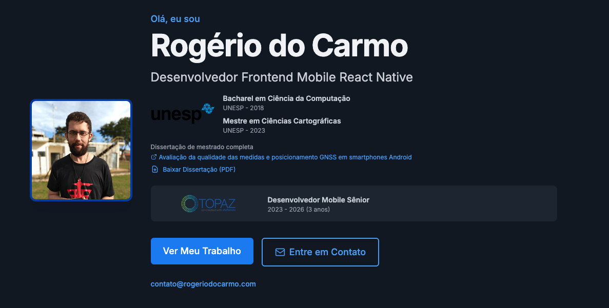

# Personal Resume Website

<!-- Build & Deployment Status -->

[](https://github.com/RogerioDoCarmo/curriculo/actions/workflows/ci.yml)
[](https://rogeriodocarmo.com)

<!-- Code Quality -->

[](https://sonarcloud.io/summary/new_code?id=RogerioDoCarmo_curriculo)
[](https://sonarcloud.io/summary/new_code?id=RogerioDoCarmo_curriculo)
[](https://sonarcloud.io/summary/new_code?id=RogerioDoCarmo_curriculo)
[](https://sonarcloud.io/summary/new_code?id=RogerioDoCarmo_curriculo)
[](https://sonarcloud.io/summary/new_code?id=RogerioDoCarmo_curriculo)

<!-- Tech Stack -->

[](https://nextjs.org/)
[](https://www.typescriptlang.org/)
[](https://reactjs.org/)
[](https://tailwindcss.com/)
[](https://rogeriodocarmo.com)
[](https://vercel.com/docs/speed-insights)
[](https://vercel.com/docs/analytics)

<!-- Project Info -->

[](https://github.com/RogerioDoCarmo/curriculo/releases)
[](https://github.com/RogerioDoCarmo/curriculo/stargazers)
[](https://github.com/RogerioDoCarmo/curriculo/issues)
[](https://opensource.org/licenses/MIT)
[](https://nodejs.org/)
[](https://github.com/RogerioDoCarmo/curriculo)
[](https://github.com/RogerioDoCarmo/curriculo/commits/main)

<!-- AI Development Tools -->

[](https://kiro.dev)
[](https://claude.ai/code)
[](https://www.chromatic.com/builds?appId=6a1b4e8a78d533ad545f5bc0)

A modern, responsive personal resume website built with Next.js 16.2.6, TypeScript, and Tailwind CSS. This website serves as both a professional portfolio and a functional resume, optimized for recruiters, AI agents, and human visitors.

[](https://rogeriodocarmo.com)

> **🤖 AI-Assisted Development**: This project was created and evolved with [Kiro IDE](https://kiro.dev) and [Claude Code](https://claude.ai/code). Kiro was used for initial project scaffolding, spec-driven feature development, and establishing coding standards. Claude Code took over for ongoing feature development, bug fixes, and refactoring — its project instructions live in [`CLAUDE.md`](./CLAUDE.md).

## 🎬 Demo

A guided walkthrough of the live site, captured at two viewport sizes. It covers dark mode, the three languages (PT / EN / ES), the project and INCT (master's research) image galleries, the interactive experience timeline, the **Used in this site** tech‑stack page, the **Storybook published on Chromatic**, and the downloadable résumé (PDF).

**Responsive — mobile & desktop, side by side:**

<video src="https://github.com/RogerioDoCarmo/curriculo/raw/main/showcase-media/walkthrough-combined.mp4" controls muted width="100%"></video>

<details>
<summary>Individual recordings (mobile · desktop)</summary>

<table>
  <tr>
    <td align="center"><b>📱 Mobile</b></td>
    <td align="center"><b>🖥️ Desktop</b></td>
  </tr>
  <tr>
    <td width="50%">
      <video src="https://github.com/RogerioDoCarmo/curriculo/raw/main/showcase-media/walkthrough.mp4" controls muted width="100%"></video>
    </td>
    <td width="50%">
      <video src="https://github.com/RogerioDoCarmo/curriculo/raw/main/showcase-media/walkthrough-desktop.mp4" controls muted width="100%"></video>
    </td>
  </tr>
</table>

</details>

> If the players don't load, open the files directly: [combined](showcase-media/walkthrough-combined.mp4) · [mobile](showcase-media/walkthrough.mp4) · [desktop](showcase-media/walkthrough-desktop.mp4). All showcase media (videos + screenshots) lives in [`showcase-media/`](showcase-media/).

## Development Progress

This project follows an incremental development approach with checkpoints to validate progress:

| Checkpoint   | Tag                   | Status      | Description                                        |
| ------------ | --------------------- | ----------- | -------------------------------------------------- |
| Checkpoint 1 | `v0.1.0-checkpoint-1` | ✅ Complete | Project setup and core infrastructure              |
| Checkpoint 2 | `v0.2.0-checkpoint-2` | ✅ Complete | Content management, i18n, theme system             |
| Checkpoint 3 | `v0.3.0-checkpoint-3` | ✅ Complete | Core UI components, layout, forms                  |
| Checkpoint 4 | _(validation only)_   | ✅ Complete | Core functionality validation                      |
| Checkpoint 5 | `v0.5.0-checkpoint-5` | ✅ Complete | Firebase integration                               |
| Checkpoint 6 | `v1.2.0`              | ✅ Complete | SEO, accessibility, print, exit intent, responsive |
| Checkpoint 7 | `v1.2.1`              | ✅ Complete | Tech stack, testing, CI/CD, deployment, SEO        |

See [tasks.md](.kiro/specs/personal-resume-website/tasks.md) for detailed implementation plan.

## Features

- **📱 Progressive Web App (PWA)**: Install on mobile devices with customized home screen shortcut
- **Multi-Language Support**: Brazilian Portuguese (pt-BR), English (en), Spanish (es)
- **Professional Email**: Custom domain email addresses (<contato@rogeriodocarmo.com> for Portuguese, <contact@rogeriodocarmo.com> for English/Spanish)
- **Linktree**: All social links in one place at [linktr.ee/rogeriodocarmo](https://linktr.ee/rogeriodocarmo)
- **Dark/Light Mode**: Automatic theme detection with manual toggle
- **Responsive Design**: Mobile-first approach with tablet and desktop optimizations
- **Career Path Selection**: Toggle between Professional Developer and Academic career paths
- **Portfolio Showcase**: Interactive project gallery with detailed views
- **Contact Form**: Integrated with Formspree for email delivery
- **SEO Optimized**: Structured data, sitemap, and meta tags
- **Accessibility**: WCAG AA compliant with keyboard navigation
- **Performance**: 90+ Lighthouse score with lazy loading
- **Print/PDF Export**: Professional print styling for resume export
- **Analytics**: Firebase Analytics and Vercel Analytics integration
- **Error Monitoring**: Firebase Crashlytics and Sentry integration
- **Push Notifications**: Firebase Cloud Messaging for new content
- **Deployment Notifications**: Automated push notifications on successful deployments (via Firebase Admin SDK in CI/CD)
- **URL Anchor Navigation**: Deep linking to specific sections
- **Tech Stack Explanation**: Simple explanations of technologies used

### 📱 Progressive Web App (PWA) Features

This website can be installed as a Progressive Web App on mobile devices, providing a native app-like experience:

- **🏠 Home Screen Installation**: Add to home screen with a clean, professional shortcut
  - **Shortcut Title**: "Rogério do Carmo" (optimized for mobile screens)
  - **Full Title for Sharing**: "Rogério do Carmo | Desenvolvedor React Native Mobile" (used in WhatsApp, social media)
- **📲 Standalone Mode**: Opens without browser UI, looks like a native app
- **🎨 Custom Theme**: Branded theme color (#2563eb) for Android UI elements
- **⚡ Splash Screen**: Professional splash screen on app launch
- **🔔 Push Notifications**: Receive updates about new content (Firebase Cloud Messaging)
- **📴 Offline Ready**: Core functionality available without internet connection

**How to Install:**

- **iOS**: Safari → Share → "Add to Home Screen"
- **Android**: Chrome → Menu → "Add to Home screen" or "Install app"

See [PWA-MANIFEST-IMPLEMENTATION.md](./docs/fixes/PWA-MANIFEST-IMPLEMENTATION.md) for technical details.

## Tech Stack

- **Framework**: Next.js 16.2.6 (App Router) with TypeScript
- **Styling**: Tailwind CSS + CSS Modules
- **Content**: Markdown files with Gray-matter parsing
- **Internationalization**: next-intl 4.9.2
- **PWA**: Web App Manifest for mobile installation
- **Testing**: Jest, React Testing Library, Playwright, fast-check, Stryker (mutation testing)
- **Component Documentation**: Storybook 8
- **Analytics**: Firebase Analytics + Vercel Analytics
- **Error Monitoring**: Firebase Crashlytics + Sentry
- **Forms**: Formspree with react-hook-form
- **Push Notifications**: Firebase Cloud Messaging
- **CI/CD**: GitHub Actions + SonarQube Cloud
- **Deployment**: Vercel with custom domains
- **Code Quality**: ESLint, Prettier, TypeScript strict mode

> **Note**: Upgraded from Next.js 14 to 16.2.6 for security fixes and performance improvements.

## Project Structure

```text
personal-resume-website/
├── app/                          # Next.js App Router
│   ├── [locale]/                 # Internationalized routes
│   ├── api/                      # API routes
│   ├── manifest.ts               # PWA Web App Manifest
│   ├── sitemap.ts                # Dynamic sitemap generation
│   └── robots.ts                 # Robots.txt generation
├── components/                   # React components
│   ├── ui/                       # Reusable UI components
│   └── sections/                 # Page sections
├── content/                      # Markdown content files
├── messages/                     # i18n translation files
├── lib/                          # Utility functions
├── hooks/                        # Custom React hooks
├── public/                       # Static assets
├── styles/                       # Additional stylesheets
├── tests/                        # Test files
├── .storybook/                   # Storybook configuration
└── .github/                      # GitHub Actions workflows
```

## Architecture & Design Patterns

The codebase follows a set of consistent design patterns and clean code conventions across all layers.

| Pattern                  | Where                                                                             |
| ------------------------ | --------------------------------------------------------------------------------- |
| Provider (Context)       | `ThemeProvider`, `AnalyticsProvider`, `NextIntlClientProvider` composed in layout |
| Custom Hook              | All stateful logic lives in `hooks/` — components are thin shells                 |
| Strategy (lookup tables) | `Button` variant/size maps replace if/switch chains                               |
| Error Boundary           | `ErrorBoundary` integrates error logging + analytics in `componentDidCatch`       |
| Cache-Aside              | `feature-flags.ts` — in-memory Map → Remote Config → default value                |
| Lazy Loading Registry    | `lib/lazy-components.tsx` centralizes all `next/dynamic` imports                  |

Key conventions enforced across the project:

- **Readonly props** on every interface — no accidental mutation
- **`import type`** for type-only imports throughout
- **No `!` non-null assertions** — type guards only (enforced in CI and CLAUDE.md)
- **Pure helpers extracted** from hooks for direct testability (e.g. `getStoredTheme`, `getInitialTheme`)
- **Named constants** over magic values (`THEME_STORAGE_KEY`, `CACHE_TTL`, `SUPPORTED_LOCALES`)
- **Graceful degradation** — `localStorage` and Firebase calls always have try/catch + defaults
- **SSR guards** — `typeof window === "undefined"` before any browser API

See [ARCHITECTURE.md](./ARCHITECTURE.md) for the full breakdown of patterns, layer responsibilities, and testing architecture.

## Development

### Prerequisites

- Node.js 24+
- npm or yarn
- Git

### Installation

```bash
# Clone the repository
git clone <repository-url>
cd personal-resume-website

# Install dependencies
npm install
# or
yarn install
```

### ⚠️ Important: Branch Protection

**The `main` and `develop` branches are protected.**

Always create a feature branch before making changes:

```bash
# Check current branch
git branch --show-current

# Create feature branch (if on main/develop)
git checkout -b feature/your-feature-name
```

See [docs/GIT-WORKFLOW.md](./docs/GIT-WORKFLOW.md) for complete Git workflow guide.

### Development Server

```bash
npm run dev
# or
yarn dev
```

Open [http://localhost:3000](http://localhost:3000) in your browser.

### Build

```bash
npm run build
# or
yarn build
```

### Production

```bash
npm start
# or
yarn start
```

### Testing

```bash
# Run all tests
npm test

# Run unit tests
npm run test:unit

# Run integration tests
npm run test:integration

# Run E2E tests
npm run test:e2e

# Run property-based tests
npm run test:properties

# Run mutation tests (Stryker — measures test quality, scoped to lib/)
npm run test:mutation

# Run Lighthouse performance tests (all-in-one: builds, serves, tests)
npm run test:lighthouse:full

# Run Lighthouse tests manually (requires production build)
npm run build && npm run serve  # Terminal 1
npm run test:lighthouse         # Terminal 2
```

**Note**: Lighthouse tests must run against the production build (`npm run serve`), not the dev server (`npm run dev`). Use `test:lighthouse:full` for convenience.

See [TESTING.md](./docs/testing/TESTING.md) for comprehensive testing guidelines and best practices.

## Deployment

The website is deployed on Vercel with automatic deployments from the main branch. The site is accessible through **11 custom domains**, all pointing to the same deployment:

- **rogeriodocarmo.com** (primary)
- rogeriodocarmo.io
- rogeriodocarmo.info
- rogeriodocarmo.click
- rogeriodocarmo.shop
- rogeriodocarmo.org
- rogeriodocarmo.net
- rogeriodocarmo.tech
- rogeriodocarmo.com.br
- rogeriodocarmo.online
- rogeriodocarmo.xyz

See [docs/DOMAINS.md](./docs/DOMAINS.md) for complete domain configuration and management guide.

## SEO & Search Engine Submission

The website is fully optimized for search engines and submitted to major search platforms:

### ✅ Completed Submissions

- **Google Search Console**: ✅ Verified and sitemap submitted
  - Primary domain: `rogeriodocarmo.com`
  - Verification method: DNS TXT record
  - Sitemap: `https://rogeriodocarmo.com/sitemap.xml` (6 URLs)
  - Status: **✅ Indexed and accessible** (verified May 5, 2026)
  - Monitoring: **✅ URL inspection and email notifications configured**

- **Bing Webmaster Tools**: ✅ Verified and sitemap submitted
  - Primary domain: `rogeriodocarmo.com`
  - Verification method: Imported from Google Search Console
  - Sitemap: `https://rogeriodocarmo.com/sitemap.xml` (6 URLs)
  - Status: Active and indexing
  - Monitoring: **✅ Email alerts and site scan configured**

### 🔍 Search Visibility

- ✅ **Domain indexed**: Site appears in search results for `site:rogeriodocarmo.com`
- ✅ **Content verified**: All pages rendering correctly with proper SEO elements
- ⏳ **Rich snippets**: Will populate within 24-72 hours of initial indexing

### 📊 SEO Features

- ✅ **Sitemap.xml**: Auto-generated with all pages and locales
- ✅ **Robots.txt**: Configured to allow all search engines
- ✅ **Structured Data**: Schema.org Person and WebSite schemas
- ✅ **Meta Tags**: Complete Open Graph and Twitter Card tags
- ✅ **Semantic HTML**: Proper heading hierarchy and semantic elements
- ✅ **Mobile-Friendly**: Responsive design optimized for all devices
- ✅ **Performance**: 90+ Lighthouse score
- ✅ **Accessibility**: WCAG AA compliant

### 📚 Documentation

- [docs/URL-INSPECTION-MONITORING-GUIDE.md](./docs/URL-INSPECTION-MONITORING-GUIDE.md) - **Complete URL inspection and monitoring setup**
- [docs/URL-INSPECTION-QUICK-CHECKLIST.md](./docs/URL-INSPECTION-QUICK-CHECKLIST.md) - **Quick checklist for monitoring setup**
- [docs/GOOGLE-SEARCH-CONSOLE-SETUP.md](./docs/GOOGLE-SEARCH-CONSOLE-SETUP.md) - Complete GSC setup guide
- [docs/GSC-DNS-VERIFICATION.md](./docs/GSC-DNS-VERIFICATION.md) - DNS TXT record verification guide
- [docs/GSC-HOSTINGER-GUIDE.md](./docs/GSC-HOSTINGER-GUIDE.md) - Hostinger-specific DNS setup
- [docs/SEO-SUBMISSION-GUIDE.md](./docs/SEO-SUBMISSION-GUIDE.md) - General search engine submission guide

### 🔍 Domain Strategy

The 10 additional domains (`.io`, `.info`, `.click`, etc.) redirect to the primary `.com` domain for SEO consolidation and brand protection. Only the primary domain is submitted to search engines to avoid duplicate content issues.

## Contact

**Professional Email Addresses:**

- **Portuguese (pt-BR)**: [contato@rogeriodocarmo.com](mailto:contato@rogeriodocarmo.com)
- **English/Spanish (en/es)**: [contact@rogeriodocarmo.com](mailto:contact@rogeriodocarmo.com)

**Social Links:**

- **Linktree**: [linktr.ee/rogeriodocarmo](https://linktr.ee/rogeriodocarmo) — all profiles in one place

These custom domain email addresses highlight the professional nature of this portfolio and are prominently displayed throughout the website.

### Environment Variables

See `.env.example` for required environment variables. Create `.env.local` for local development.

## Code Quality

- **Test Coverage**: Minimum 80% enforced in CI/CD
- **Mutation Testing**: Stryker on `lib/` (50% break threshold), non-blocking signal on pull requests and deploys
- **Code Quality**: SonarQube with 90% quality rating (A) requirement
- **Linting**: ESLint with Next.js recommended rules
- **Formatting**: Prettier with consistent formatting
- **Type Safety**: TypeScript strict mode

See [CONTRIBUTING.md](./docs/development/CONTRIBUTING.md) for code style guidelines and development workflow.

## License

MIT

## Documentation

- [ARCHITECTURE.md](./ARCHITECTURE.md) - Design patterns, layer responsibilities, and testing architecture
- [TESTING.md](./docs/testing/TESTING.md) - Comprehensive testing guide and best practices
- [CONTRIBUTING.md](./docs/development/CONTRIBUTING.md) - Code style guidelines and development workflow
- [PWA-MANIFEST-IMPLEMENTATION.md](./docs/fixes/PWA-MANIFEST-IMPLEMENTATION.md) - **Progressive Web App setup and features** 📱
- [docs/BADGES.md](./docs/BADGES.md) - **Explanation of all quality badges** (16 badges)
- [docs/GIT-WORKFLOW.md](./docs/GIT-WORKFLOW.md) - **Git workflow and branch protection guide** ⚠️
- [docs/DOMAINS.md](./docs/DOMAINS.md) - **Domain configuration and management** (11 domains)
- [docs/SEO-SUBMISSION-GUIDE.md](./docs/SEO-SUBMISSION-GUIDE.md) - Search engine submission guide
- [docs/firebase-remote-config-setup.md](./docs/firebase-remote-config-setup.md) - **Firebase Remote Config setup and feature flags** 🚀
- [docs/TOGGLE-FEATURE-FLAG.md](./docs/TOGGLE-FEATURE-FLAG.md) - **Quick reference for toggling feature flags** ⚡
- [.kiro/docs/test-patterns.md](./.kiro/docs/test-patterns.md) - Quick reference for test patterns
- [.kiro/docs/mutation-testing.md](./.kiro/docs/mutation-testing.md) - **Mutation testing (Stryker): setup, scope, thresholds, CI** 🧬
- [.kiro/docs/code-quality-fixes.md](./.kiro/docs/code-quality-fixes.md) - Code quality improvements log
